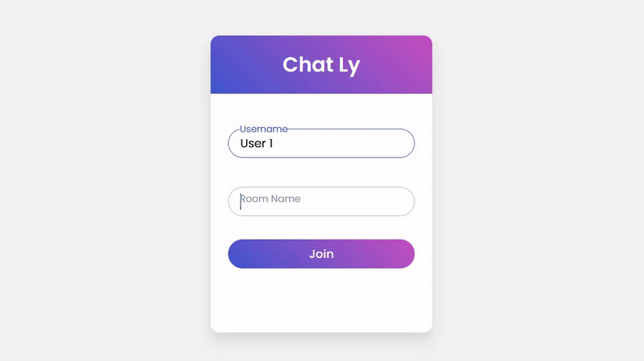

 

# Chat-Ly

**Unlock the key to good mental health. Chat anonymously, beat your boredom and depression.**

###### Chat-Ly is a beautifull web Application to chat with your friends by creating your own rooms.

##### Live version Availiable [here](https://chat-ly.vercel.app/)! 

##### This project is [MIT](https://choosealicense.com/licenses/mit/) licenced
